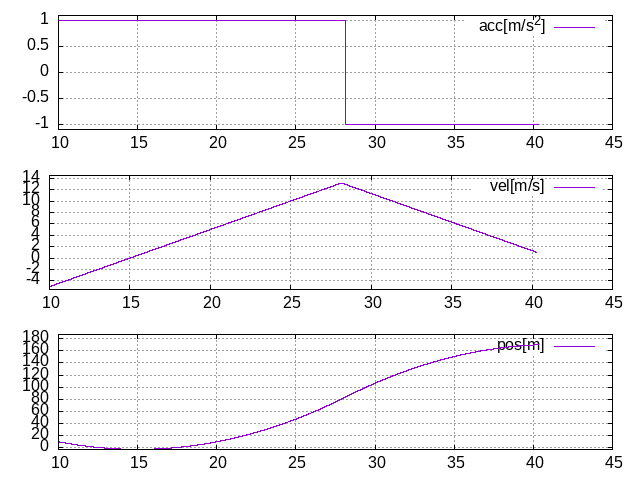
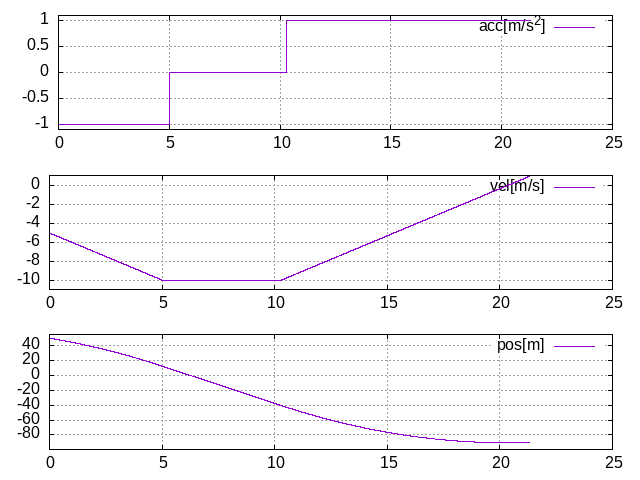

# Two points interpolation CPP
C++ implementation of https://github.com/yuokamoto/two_points_interpolation_py

## Example
### Rependency
- yaml-cpp: `sudo apt install libyaml-cpp-dev`
- gnuplot: `sudo apt-get install gnuplot`

### Build and Run
1. update constraints in `examples/constraints.yaml`
2. build and run
    ```
    cd example && ./build_and_run.sh
    ```
    output `data_txt` and `graph.png` are saved under `examples` dir.

### Example result
#### case 0: not reach velocity limit
constraints: 
- p0 = 10, pe = 170.0
- v0 = -5, ve = 1
- amax = 1, vmax = 100
- t0 = 10



#### case 1: reach velocity limit
constraints: 
- p0 = 50, pe = -90.0
- v0 = -5, ve = 1
- amax = 1, vmax = 10
- t0 = 0

